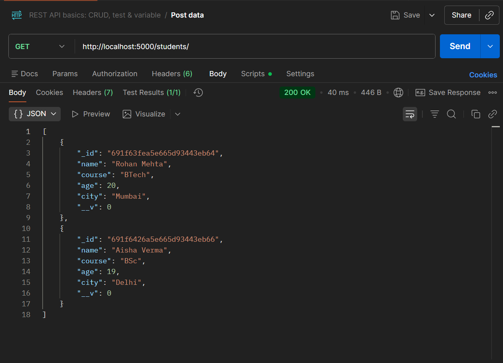
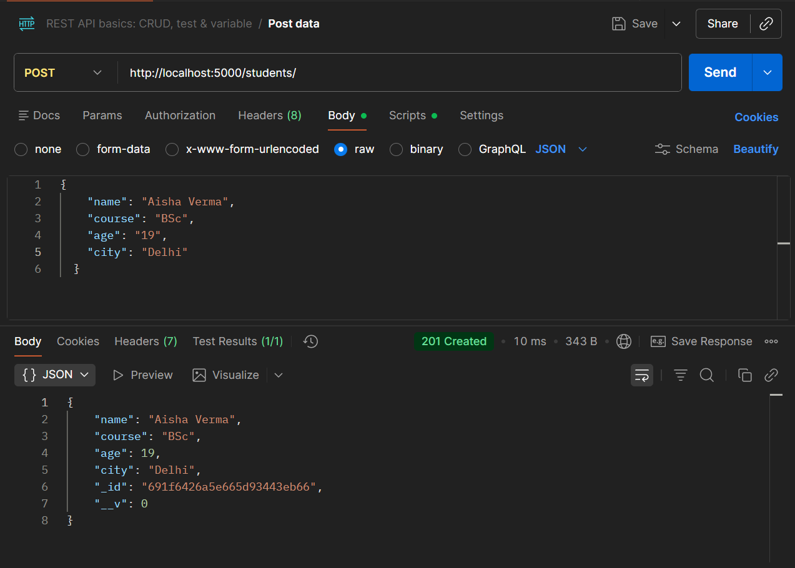
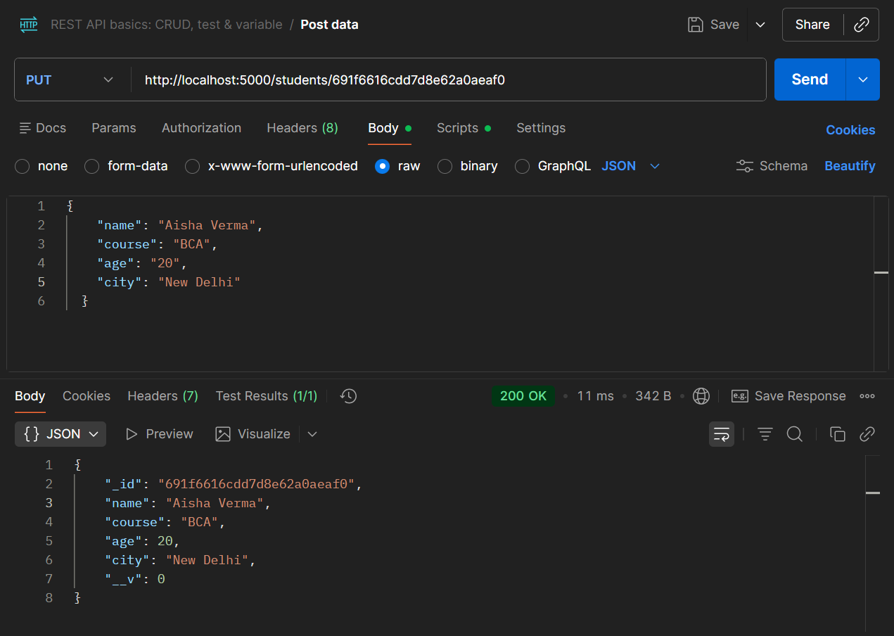
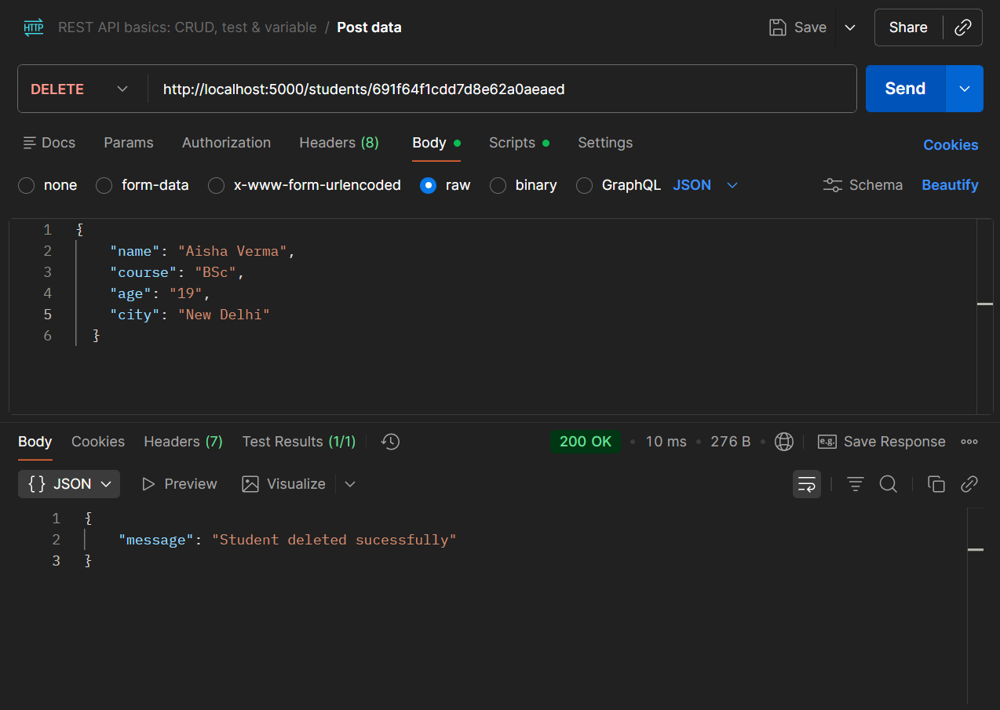

# Student Record API

Simple RESTful API to manage student records (create, read, update, delete).

## Quick start

1. Initialize:
   ```bash
   npm init -y
   ```
2. Install dependencies:
   ```bash
   npm i express mongoose dotenv
   ```

## Endpoints

- GET /students — list all students
- POST /students — create a new student
- PUT /students/:id — update a student by id
- DELETE /students/:id — delete a student by id

Typical student object:

```json
{
  "name": "Karan Sharma",
  "course": "BBA",
  "age": 21,
  "city": "Jaipur"
}
```

## Examples

GET — list all students  
Request: GET /students  
Response: 200 OK, JSON array of student objects.

Postman output:


POST — create a student  
Request: POST /students  
Body (JSON):

```json
{
  "name": "Aisha Verma",
  "course": "B.Sc",
  "age": 19,
  "city": "Delhi"
}
```

Response: 201 Created, created student object (includes generated id).

Postman output:


PUT — update a student  
Request: PUT /students/:id  
Body (JSON): same shape as POST.  
Response: 200 OK, updated student object.

Postman output:


DELETE — remove a student  
Request: DELETE /students/:id  
Response: 204 No Content (or 200 with confirmation).

Postman output:

